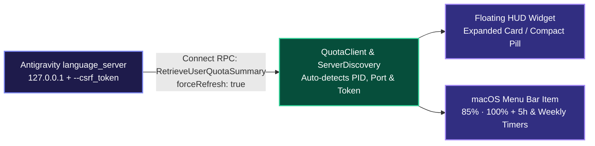

<div align="center">

# ⚡ AntigravityQuota

**Real-Time Model Quota Monitor & Floating HUD Widget for Google Antigravity on macOS**

[](https://github.com/Fuheshka/AntigravityQuota)
[](https://swift.org)
[](LICENSE)
[]()

[**🇬🇧 English**](README.md) | [**🇷🇺 Русский**](README.ru.md)

</div>

---

## Overview

**AntigravityQuota** is a lightweight, zero-dependency native macOS utility (`AppKit` + `SwiftUI`, `LSUIElement` accessory daemon) that displays live **Google Antigravity** model usage limits (**5-hour rolling window** and **weekly quota**) for both the **Gemini** pool and the **Claude / GPT-OSS** pool.

Instead of opening `Settings -> Models` and manually clicking **Refresh**, AntigravityQuota automatically discovers the local `language_server` process and queries `RetrieveUserQuotaSummary` (`forceRefresh: true`) and `GetCascadeModelConfigData` every **20 seconds**.

---

## Key Features

- **Floating HUD Over Antigravity (`QuotaHUDWindow`)**:
  - Translucent macOS HUD card (`NSVisualEffectView` `.hudWindow`) displaying color-coded progress bars, exact remaining percentages, reset countdown timers, and weekly limits.
  - **Compact Pill Mode**: Collapse the card into a minimal floating pill (`● G 85.4% 1h 12m · ● C 100%`) with a single click, and click anywhere on the pill to expand it back.
  - **Smart Context Visibility**: Automatically appears when `Antigravity.app` is the active frontmost window and hides when switching to other apps (via `NSWorkspace`, requiring **zero** Accessibility/TCC permissions).
  - Freely draggable anywhere on screen with persistent coordinates in `UserDefaults`.
- **macOS Menu Bar Status Item (`StatusBarController`)**:
  - Always-visible summary (`85% · 100%`) in the macOS menu bar with a native SF Symbol gauge icon.
  - Detailed dropdown menu with 5-hour and weekly reset clocks, per-model quota submenu, HUD toggles, and one-click **Launch at Login** (`LaunchAgent`).
- **Automatic Reconnection**: Seamlessly re-discovers PID, CSRF token, and localhost ports if `Antigravity.app` restarts.
- **Bilingual UI (EN / RU)**: Automatically adapts all menus, labels, and countdown units to the system language.

---

## Architecture



---

## Keyboard Shortcuts (Menu Bar)

| Shortcut | Action |
| :--- | :--- |
| `⌘R` | Force refresh quotas immediately |
| `⌘H` | Show / hide floating HUD widget |
| `⌘M` | Toggle compact HUD pill mode |
| `⌘Q` | Quit AntigravityQuota |

---

## Build & Installation

### Requirements
- macOS 13.0 (Ventura) or later
- Swift 5.9+ (Xcode Command Line Tools)

### Build from Source

```bash
git clone https://github.com/Fuheshka/AntigravityQuota.git
cd AntigravityQuota

# Run unit tests
swift test

# Build Release bundle and install to /Applications/AntigravityQuota.app
./scripts/build_app.sh

# Launch application
open /Applications/AntigravityQuota.app
```

---

## License

Released under the [MIT License](LICENSE).
