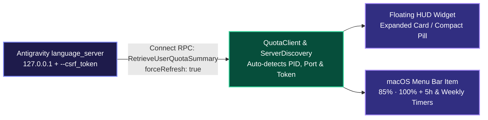

<div align="center">

# ⚡ AntigravityQuota

**Real-Time Model Quota Monitor & Floating HUD Widget for Google Antigravity on macOS**

[](https://github.com/Fuheshka/AntigravityQuota)
[](https://swift.org)
[](LICENSE)
[]()

[**🇬🇧 English**](README.md) | [**🇷🇺 Русский**](README.ru.md)

</div>

---

## Overview

**AntigravityQuota** is a lightweight, zero-dependency native macOS utility (`AppKit` + `SwiftUI`, `LSUIElement` accessory daemon) that displays live **Google Antigravity** model usage limits (**5-hour rolling window** and **weekly quota**) for both the **Gemini** pool and the **Claude / GPT-OSS** pool.

Instead of opening `Settings -> Models` and manually clicking **Refresh**, AntigravityQuota automatically discovers the local `language_server` process and queries `RetrieveUserQuotaSummary` (`forceRefresh: true`) and `GetCascadeModelConfigData` every **20 seconds**.

---

## Key Features

- **Floating HUD Over Antigravity (`QuotaHUDWindow`)**:
  - Translucent macOS HUD card (`NSVisualEffectView` `.hudWindow`) displaying color-coded progress bars, exact remaining percentages, reset countdown timers, and weekly limits.
  - **Compact Pill Mode**: Collapse the card into a minimal floating pill (`● G 85.4% 1h 12m · ● C 100%`) with a single click, and click anywhere on the pill to expand it back.
  - **Smart Context Visibility**: Automatically appears when `Antigravity.app` is the active frontmost window and hides when switching to other apps (via `NSWorkspace`, requiring **zero** Accessibility/TCC permissions).
  - Freely draggable anywhere on screen with persistent coordinates in `UserDefaults`.
- **macOS Menu Bar Status Item (`StatusBarController`)**:
  - Always-visible summary (`85% · 100%`) in the macOS menu bar with a native SF Symbol gauge icon.
  - Detailed dropdown menu with 5-hour and weekly reset clocks, per-model quota submenu, HUD toggles, and one-click **Launch at Login** (`LaunchAgent`).
- **Interactive About & Diagnostics Window (`AboutWindowController`)**:
  - Live connection status, detected `language_server` PID, API listening ports, and real-time quota metrics.
  - Quick reference for keyboard shortcuts and interaction tips (dragging, pill mode, auto-hide).
  - One-click diagnostic report copying to clipboard for effortless troubleshooting and bug reports.
  - Direct links to GitHub repository and latest releases.
- **Automatic Reconnection**: Seamlessly re-discovers PID, CSRF token, and localhost ports if `Antigravity.app` restarts.
- **Bilingual UI (EN / RU)**: Automatically adapts all menus, labels, and countdown units to the system language.

---

## Architecture



---
---

## Visual Overview & Interface

<div align="center">

### Floating HUD Widget & Compact Pill Mode


<p align="center">
  <em>Dual adaptive display modes: a translucent 256 pt HUD card with color-coded progress bars, burn rate trends, and 3-hour activity sparklines, collapsible into an unobtrusive floating pill.</em>
</p>


<p align="center">
  <em>Fluid, interruptible morph transition between expanded card and compact pill with zero lag.</em>
</p>

<br/>

### Menu Bar Status Item & Dropdown Menu


<p align="center">
  <em>Live menu bar gauge (<code>3.8%↓ · 100%→</code>), 5-hour and weekly reset countdowns, nested per-model breakdown submenu, and customizable HUD toggles.</em>
</p>

<br/>

### About & Diagnostics Window


<p align="center">
  <em>Live server connection metrics (PID, active API ports), notification toggles, global hotkeys reference, helpful tips, and one-click diagnostic report copying.</em>
</p>

</div>

---

## Global Hotkeys & Interaction

AntigravityQuota registers system-wide global hotkeys via the native macOS **Carbon Event HotKey API**. They operate globally across all desktops and full-screen applications with **zero Accessibility (TCC) or Input Monitoring permissions required**.

| Hotkey | Action | Scope | Description |
| :--- | :--- | :--- | :--- |
| **`⌥⇧Q`** (`Option + Shift + Q`) | Toggle HUD Visibility | Global | Instantly shows or hides the floating HUD widget on screen. |
| **`⌥⇧M`** (`Option + Shift + M`) | Toggle Pill / Card Mode | Global | Switches between the compact floating pill and the expanded 256 pt card. |
| **`⌥⇧R`** (`Option + Shift + R`) | Force Refresh Quotas | Global | Immediately queries local Connect RPC endpoints for fresh quota balances. |
| **`⌘Q`** (`Command + Q`) | Quit Application | In-App / Menu | Safely terminates the background daemon and removes status bar items. |

### Mouse Interaction & Window Management
- **One-Click Morph**: Click anywhere on the compact pill (or the expand icon `↖↘`) to expand it into the full HUD card. Click the minus button (`−`) in the card header to collapse back to the pill.
- **Draggable with Magnetic Snapping**: Drag the HUD anywhere on screen. It automatically snaps to screen edges within a 16 pt margin and persists coordinates in `UserDefaults`.
- **Smart Window Anchoring**: Stays in the floating utility window level (`.floating`) on all virtual spaces (`.canJoinAllSpaces`, `.fullScreenAuxiliary`). Anchors to its bottom-right coordinate so changing modes never pushes it offscreen.
- **Click-Through Mode**: When enabled in HUD Settings, clicks pass straight through the HUD to the editor beneath. Hold **`⌥ Option`** to temporarily grab and interact with the HUD without toggling the setting.
- **Auto-Hide Outside Antigravity**: Automatically conceals the HUD when you switch to other apps and restores it the instant `Antigravity.app` becomes active.

---

## Command Line Interface (CLI)

AntigravityQuota includes a dedicated headless CLI mode (`antigravity-quota`) optimized for scripting, terminal multiplexers (**tmux**, **zellij**), custom status bars (**SketchyBar**, **SwiftBar**, **Waybar**), and launcher workflows (**Raycast**, **Alfred**).

In CLI mode, the application bypasses all GUI lifecycles, performs a single Connect-RPC request to the local `language_server`, outputs the formatted response to `stdout`, and terminates immediately with code 0 (or code 1 on connection failure).

### CLI Flags & Commands

| Flag | Purpose | Example Output / Format |
| :--- | :--- | :--- |
| `--status`, `-s` | Compact single-line quota string | `G 85.4% (1h 12m) · C 100.0%` |
| `--json`, `-j` | Complete formatted JSON snapshot | Detailed JSON with pools, models, and reset times |
| `--history` | Recent measurements table from disk history | Unicode Box-Drawing ASCII table |
| `--export-history` | Export full 7-day disk history as JSON | Array of historical measurement points |
| `-h`, `--help` | Display usage and integration examples | Full CLI help reference |

#### Example: Compact Status Output
```bash
antigravity-quota --status
# Output: G 85.4% (1h 12m) · C 100.0%
```

#### Example: Complete JSON Snapshot
```bash
antigravity-quota --json
```
```json
{
  "updatedAt": "2026-10-01T10:24:00Z",
  "summary": {
    "gemini": { "percentage": 85.4, "resetCountdown": "1h 12m", "resetTime": "2026-10-01T11:36:00Z" },
    "claude": { "percentage": 100.0, "resetCountdown": "—", "resetTime": "2026-10-01T15:24:00Z" },
    "status": "G 85.4% (1h 12m) · C 100.0%"
  },
  "groups": [
    {
      "displayName": "Gemini Models",
      "shortName": "Gemini",
      "buckets": [
        { "window": "5h", "percentage": 85.4, "remainingFraction": 0.854, "resetCountdown": "1h 12m" },
        { "window": "weekly", "percentage": 94.0, "remainingFraction": 0.940, "resetCountdown": "3d 8h" }
      ]
    }
  ]
}
```

#### Example: Local History Table
```bash
antigravity-quota --history
```
```text
┌──────────────────────┬─────────────┬─────────────┐
│ Date & Time          │ Gemini Pool │ Claude Pool │
├──────────────────────┼─────────────┼─────────────┤
│ 2026-10-01 10:24:00  │ 85.4%       │ 100.0%      │
│ 2026-10-01 10:20:00  │ 86.8%       │ 100.0%      │
│ 2026-10-01 10:00:00  │ 92.1%       │ 100.0%      │
└──────────────────────┴─────────────┴─────────────┘
```

### CLI Symlink Installation

If installed via Homebrew Cask, the `antigravity-quota` binary is automatically linked into your PATH.

For manual installations, create the symlink system-wide:

```bash
# Automatic installer (creates ~/.local/bin or /usr/local/bin symlink)
./scripts/install_cli_symlink.sh

# Or manual symlink to /usr/local/bin:
sudo ln -sf "/Applications/AntigravityQuota.app/Contents/MacOS/AntigravityQuota" /usr/local/bin/antigravity-quota
```

### Integrations

Ready-to-use scripts with Nerd Font glyphs, dynamic status color alerts, model breakdowns, and quick actions are provided in [`integrations/`](integrations/README.md):

- **[Raycast Script Command](integrations/raycast/antigravity-quota.sh)**:
  Displays live quota balance inline directly inside your Raycast search bar, with `--full` detail view on command.
- **[SketchyBar Plugin](integrations/sketchybar/README.md)**:
  `integrations/sketchybar/antigravity_quota.sh` formats quotas with Nerd Font icons (`󰛩`, `󰚩`), countdown clocks, and dynamic status alert colors (>50% green, 20-50% orange, <20% red).
  ```bash
  sketchybar --add item antigravity_quota right \
             --set antigravity_quota update_freq=30 icon.drawing=off \
                                     script="~/.config/sketchybar/plugins/antigravity_quota.sh"
  ```
- **[SwiftBar & BitBar Plugin](integrations/swiftbar/antigravity_quota.1m.sh)**:
  Menu bar status plus an interactive dropdown menu with model breakdown, rolling 5h / weekly window counters, and quick actions ("Open Antigravity", "Refresh Quotas").
- **tmux Status Line**:
  ```tmux
  set -g status-right '#(antigravity-quota --status) | %H:%M'
  ```

---

## Installation

### macOS

#### Homebrew (Recommended)

Install and keep AntigravityQuota updated with a single terminal command via Homebrew Cask:

```bash
# Tap official repository
brew tap Fuheshka/antigravityquota https://github.com/Fuheshka/AntigravityQuota

# Install AntigravityQuota (app bundle and antigravity-quota CLI binary)
brew install --cask antigravity-quota
```

To update to the latest release in the future:
```bash
brew upgrade --cask antigravity-quota
```

#### Pre-built macOS Release

Download the pre-packaged `.dmg` or `.zip` installer from [GitHub Releases](https://github.com/Fuheshka/AntigravityQuota/releases/latest).

#### Build from Source on macOS

- macOS 13.0 (Ventura) or later
- Swift 5.9+ (Xcode Command Line Tools)

```bash
git clone https://github.com/Fuheshka/AntigravityQuota.git
cd AntigravityQuota

# Run unit tests
swift test

# Build Release bundle and install to /Applications/AntigravityQuota.app
./scripts/build_app.sh

# Launch application
open /Applications/AntigravityQuota.app
```

---

### Windows

#### Pre-built Portable Release (Single-File)

AntigravityQuota provides a self-contained portable executable `AntigravityQuota.exe` (ReadyToRun, Self-Contained). No prior .NET Runtime installation is needed: all necessary libraries and dependencies are bundled directly inside the binary.

1. Download `AntigravityQuota-v1.x.x-windows-x64.zip` from [GitHub Releases](https://github.com/Fuheshka/AntigravityQuota/releases/latest).
2. Extract the archive into your preferred directory (e.g. `C:\Tools\AntigravityQuota`).
3. Run `AntigravityQuota.exe`.

The application will dock into your Windows taskbar system tray next to the clock. Clicking the tray icon opens an interactive flyout showing your real-time quota balances, model reset countdowns, and quick actions.

#### Usage on Windows
- **System Tray:** Displays real-time status and color indicators. Right-click opens the context menu (refresh quotas, open diagnostics, quit), left-click reveals detailed statistics.
- **Floating HUD Overlay:** Smooth overlay anchored over Antigravity editor with full card and compact pill modes.
- **Global Hotkeys:**
  - `Alt + Shift + Q` - toggle floating HUD overlay visibility.
  - `Alt + Shift + M` - toggle between full card (256 pt) and compact pill modes.
  - `Alt + Shift + R` - force-refresh quota balance from local Antigravity server.

#### Build from Source on Windows

Requirements:
- Windows 10/11 x64
- .NET 9.0 SDK or later

Build release distribution archive using PowerShell:
```powershell
# Clone repository
git clone https://github.com/Fuheshka/AntigravityQuota.git
cd AntigravityQuota

# Run automated Windows release builder script
.\scripts\build_windows_release.ps1
```

Once completed, the packaged `AntigravityQuota-v1.x.x-windows-x64.zip` archive and standalone `AntigravityQuota.exe` will be located in the `dist/` directory.

Manual build via .NET CLI:
```powershell
# Run unit tests
dotnet test src/windows/AntigravityQuota.sln

# Publish self-contained single-file executable
dotnet publish src/windows/AntigravityQuota.App/AntigravityQuota.App.csproj -c Release -r win-x64 --self-contained true -p:PublishSingleFile=true -p:PublishReadyToRun=true
```

---

## Contributing

Contributions to AntigravityQuota are warmly welcomed! Here is how you can help:

- 🐛 **Report Bugs**: Encountered a glitch or crash? File a [Bug Report](https://github.com/Fuheshka/AntigravityQuota/issues/new?template=bug_report.md).
- 💡 **Request Features**: Need a new status bar integration, custom HUD hotkey, or plugin? Submit a [Feature Request](https://github.com/Fuheshka/AntigravityQuota/issues/new?template=feature_request.md).
- 🛠 **Submit Pull Requests**: Want to fix an issue or add a feature? Check out our [Contributing Guide (CONTRIBUTING.md)](CONTRIBUTING.md) and open a PR!
- ⭐️ **Star the Repo**: Give the project a star on GitHub to help others discover it.

---

## Author & Support

Made with passion and love ❤️

**Daniil K. (Fuheshka)**

- 💬 **Telegram:** [@fuheshka](https://t.me/fuheshka)
- ✉️ **Email:** [me@kuviko.ru](mailto:me@kuviko.ru)
- ☕ **Buy me a coffee (SBP / T-Pay):** [pay.cloudtips.ru/p/7adeaa28](https://pay.cloudtips.ru/p/7adeaa28)
- 💎 **TON:** `UQC-DsraaDQRjUjG9oPRkt5nGlMgxKY-pjMC6xeeYGfxiu9a`

---

## License

Released under the [MIT License](LICENSE).
