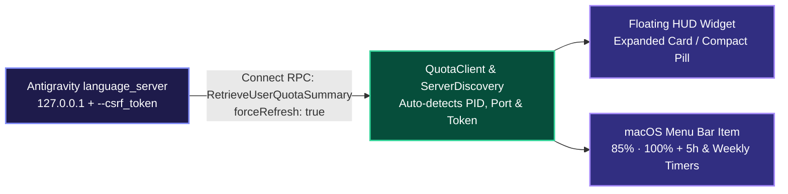

<div align="center">

# ⚡ AntigravityQuota

**Real-Time Model Quota Monitor & Floating HUD Widget for Google Antigravity on macOS**

[](https://github.com/Fuheshka/AntigravityQuota)
[](https://swift.org)
[](LICENSE)
[]()

[**🇬🇧 English**](README.md) | [**🇷🇺 Русский**](README.ru.md)

</div>

---

## Overview

**AntigravityQuota** is a lightweight, zero-dependency native macOS utility (`AppKit` + `SwiftUI`, `LSUIElement` accessory daemon) that displays live **Google Antigravity** model usage limits (**5-hour rolling window** and **weekly quota**) for both the **Gemini** pool and the **Claude / GPT-OSS** pool.

Instead of opening `Settings -> Models` and manually clicking **Refresh**, AntigravityQuota automatically discovers the local `language_server` process and queries `RetrieveUserQuotaSummary` (`forceRefresh: true`) and `GetCascadeModelConfigData` every **20 seconds**.

---

## Key Features

- **Floating HUD Over Antigravity (`QuotaHUDWindow`)**:
  - Translucent macOS HUD card (`NSVisualEffectView` `.hudWindow`) displaying color-coded progress bars, exact remaining percentages, reset countdown timers, and weekly limits.
  - **Compact Pill Mode**: Collapse the card into a minimal floating pill (`● G 85.4% 1h 12m · ● C 100%`) with a single click, and click anywhere on the pill to expand it back.
  - **Smart Context Visibility**: Automatically appears when `Antigravity.app` is the active frontmost window and hides when switching to other apps (via `NSWorkspace`, requiring **zero** Accessibility/TCC permissions).
  - Freely draggable anywhere on screen with persistent coordinates in `UserDefaults`.
- **macOS Menu Bar Status Item (`StatusBarController`)**:
  - Always-visible summary (`85% · 100%`) in the macOS menu bar with a native SF Symbol gauge icon.
  - Detailed dropdown menu with 5-hour and weekly reset clocks, per-model quota submenu, HUD toggles, and one-click **Launch at Login** (`LaunchAgent`).
- **Interactive About & Diagnostics Window (`AboutWindowController`)**:
  - Live connection status, detected `language_server` PID, API listening ports, and real-time quota metrics.
  - Quick reference for keyboard shortcuts and interaction tips (dragging, pill mode, auto-hide).
  - One-click diagnostic report copying to clipboard for effortless troubleshooting and bug reports.
  - Direct links to GitHub repository and latest releases.
- **Automatic Reconnection**: Seamlessly re-discovers PID, CSRF token, and localhost ports if `Antigravity.app` restarts.
- **Bilingual UI (EN / RU)**: Automatically adapts all menus, labels, and countdown units to the system language.

---

## Architecture



---

## Keyboard Shortcuts (Menu Bar)

| Shortcut | Action |
| :--- | :--- |
| `⌘R` | Force refresh quotas immediately |
| `⌘H` | Show / hide floating HUD widget |
| `⌘M` | Toggle compact HUD pill mode |
| `⌘Q` | Quit AntigravityQuota |

## Command Line Interface (CLI)

AntigravityQuota supports a dedicated headless CLI mode for integration with **SketchyBar**, **SwiftBar**, **Raycast**, **tmux**, and terminal automation scripts. In CLI mode, the application skips all GUI lifecycles, makes a single RPC query to the local `language_server`, prints to `stdout`, and exits with code 0 (or code 1 on connection failure).

### CLI Flags

| Flag | Description | Example Output |
| :--- | :--- | :--- |
| `--status`, `-s` | Compact single-line quota status | `G 85.4% (1h 12m) · C 100.0%` |
| `--json`, `-j` | Complete formatted JSON snapshot with pools and individual models | `{"summary": {...}, "groups": [...], "models": [...]}` |
| `--history` | Terminal table of recent quota measurements from local disk history | Formatted ASCII/Unicode table |
| `--export-history` | Export full measurement history (last 7 days) as JSON to stdout | `[{"timestamp": "...", "geminiPercentage": 85.4, ...}]` |
| `-h`, `--help` | Display usage and integration examples | Help reference |

### CLI Symlink Installation

If installed via Homebrew Cask, the `antigravity-quota` binary is automatically linked to your PATH.

For manual installations, to make `antigravity-quota` available system-wide:

```bash
# Automatic installer (creates ~/.local/bin or /usr/local/bin symlink)
./scripts/install_cli_symlink.sh

# Or manual symlink to /usr/local/bin:
sudo ln -sf "/Applications/AntigravityQuota.app/Contents/MacOS/AntigravityQuota" /usr/local/bin/antigravity-quota
```

### Integrations

Ready-to-use plugins with Nerd Font glyphs, dynamic color alerts, model breakdowns, and quick actions are provided in [`integrations/`](integrations/README.md):

- **[SketchyBar Plugin](integrations/sketchybar/README.md)**:
  `integrations/sketchybar/antigravity_quota.sh` formats live quotas with Nerd Font icons (`󰛩`, `󰚩`), reset timers, and ARGB threshold colors (>50% green, 20-50% orange, <20% red).
  ```bash
  sketchybar --add item antigravity_quota right \
             --set antigravity_quota update_freq=30 icon.drawing=off \
                                     script="~/.config/sketchybar/plugins/antigravity_quota.sh"
  ```

- **[SwiftBar & BitBar Plugin](integrations/README.md#2-swiftbar-и-bitbar)**:
  `integrations/swiftbar/antigravity_quota.1m.sh` provides a sleek menu bar status plus an interactive dropdown menu with model breakdown, rolling 5h / weekly window counters, and quick actions ("Open Antigravity", "Refresh Quotas").

- **tmux status line**:
  ```tmux
  set -g status-right '#(antigravity-quota --status) | %H:%M'
  ```

---

## Installation

### Homebrew (Recommended)

Install and keep AntigravityQuota updated with a single terminal command via Homebrew Cask:

```bash
# Tap official repository
brew tap Fuheshka/antigravityquota https://github.com/Fuheshka/AntigravityQuota

# Install AntigravityQuota (app bundle and antigravity-quota CLI binary)
brew install --cask antigravity-quota
```

To update to the latest release in the future:
```bash
brew upgrade --cask antigravity-quota
```

### Manual Download

Download the pre-packaged `.dmg` or `.zip` installer from [GitHub Releases](https://github.com/Fuheshka/AntigravityQuota/releases/latest).

### Build from Source

#### Requirements
- macOS 13.0 (Ventura) or later
- Swift 5.9+ (Xcode Command Line Tools)

```bash
git clone https://github.com/Fuheshka/AntigravityQuota.git
cd AntigravityQuota

# Run unit tests
swift test

# Build Release bundle and install to /Applications/AntigravityQuota.app
./scripts/build_app.sh

# Launch application
open /Applications/AntigravityQuota.app
```

---

## Contributing

Contributions to AntigravityQuota are warmly welcomed! Here is how you can help:

- 🐛 **Report Bugs**: Encountered a glitch or crash? File a [Bug Report](https://github.com/Fuheshka/AntigravityQuota/issues/new?template=bug_report.md).
- 💡 **Request Features**: Need a new status bar integration, custom HUD hotkey, or plugin? Submit a [Feature Request](https://github.com/Fuheshka/AntigravityQuota/issues/new?template=feature_request.md).
- 🛠 **Submit Pull Requests**: Want to fix an issue or add a feature? Check out our [Contributing Guide (CONTRIBUTING.md)](CONTRIBUTING.md) and open a PR!
- ⭐️ **Star the Repo**: Give the project a star on GitHub to help others discover it.

---

## Author & Support

Made with passion and love ❤️

**Daniil K. (Fuheshka)**

- 💬 **Telegram:** [@fuheshka](https://t.me/fuheshka)
- ✉️ **Email:** [me@kuviko.ru](mailto:me@kuviko.ru)
- ☕ **Buy me a coffee (SBP / T-Pay):** [pay.cloudtips.ru/p/7adeaa28](https://pay.cloudtips.ru/p/7adeaa28)
- 💎 **TON:** `UQC-DsraaDQRjUjG9oPRkt5nGlMgxKY-pjMC6xeeYGfxiu9a`

---

## License

Released under the [MIT License](LICENSE).
