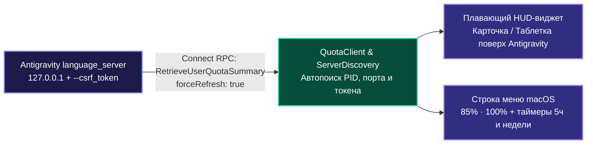

<div align="center">

# ⚡ AntigravityQuota

**Монитор лимитов моделей в реальном времени и плавающий HUD-виджет для Google Antigravity на macOS**

[](https://github.com/Fuheshka/AntigravityQuota)
[](https://swift.org)
[](LICENSE)
[]()

[**🇬🇧 English**](README.md) | [**🇷🇺 Русский**](README.ru.md)

</div>

---

## О проекте

**AntigravityQuota** - легкая нативная утилита для macOS без внешних зависимостей (`AppKit` + `SwiftUI`, фоновый режим `LSUIElement` без иконки в Dock), отображающая актуальные лимиты моделей **Google Antigravity** (**5-часовой скользящий лимит** и **недельную квоту**) по пулам **Gemini** и **Claude / GPT-OSS**.

Вместо ручного перехода в `Settings -> Models` и нажатия кнопки обновления, утилита автоматически находит локальный процесс `language_server` и каждые **20 секунд** вызывает Connect-RPC методы `RetrieveUserQuotaSummary` (`forceRefresh: true`) и `GetCascadeModelConfigData`.

---

## Основные возможности

- **Плавающий HUD-виджет поверх Antigravity (`QuotaHUDWindow`)**:
  - Полупрозрачная карточка из матового стекла (`NSVisualEffectView` `.hudWindow`) с цветными индикаторами остатка, точными процентами, обратным отсчетом до сброса и недельным лимитом.
  - **Компактный режим (таблетка)**: сворачивается в мини-пилюлю (`● G 85.4% 1ч 12м · ● C 100%`) и разворачивается обратно по обычному клику в любую область таблетки или кнопку `↖↘`.
  - **Умная видимость без прав Accessibility**: автоматически появляется поверх активного окна `Antigravity.app` и прячется при переключении в другие программы через `NSWorkspace` (не требует выдачи спецправ в настройках безопасности macOS).
  - Свободное перетаскивание мышью в любую точку экрана с сохранением позиции.
- **Индикатор в строке меню macOS (`StatusBarController`)**:
  - Постоянная сводка (`85% · 100%`) в верхнем статус-баре macOS рядом с часами.
  - Выпадающее меню с точным временем сброса 5-часовых и недельных квот, подменю со списком всех моделей, настройками HUD и автозапуском при входе в систему (`LaunchAgent`).
- **Информативное окно «О программе» и диагностика (`AboutWindowController`)**:
  - Отображение текущего статуса подключения, обнаруженного PID процесса `language_server`, портов API и живых процентов квот.
  - Памятка по всем горячим клавишам и возможностям управления (перетаскивание HUD, автоскрытие, режим таблетки).
  - Быстрое копирование полного диагностического отчета в буфер обмена одной кнопкой.
  - Прямые ссылки на GitHub-репозиторий и раздел релизов.
- **Автоматическое переподключение**: прозрачно обновляет PID, CSRF-токен и порт при перезапуске `Antigravity.app`.
- **Двуязычный интерфейс (RU / EN)**: автоматическое определение системного языка macOS.

---

## Архитектура



---

## Горячие клавиши (в меню статус-бара)

| Сочетание | Действие |
| :--- | :--- |
| `⌘R` | Принудительно обновить лимиты сейчас |
| `⌘H` | Показать / скрыть плавающий HUD-виджет |
| `⌘M` | Переключить компактный режим HUD (таблетка) |
| `⌘Q` | Выйти из AntigravityQuota |

## Интерфейс командной строки (CLI)

AntigravityQuota поддерживает автономный CLI-режим для интеграции с **SketchyBar**, **SwiftBar**, **Raycast**, **tmux** и консольными скриптами автоматизации. В режиме CLI программа не запускает GUI и статус-бар, а выполняет один сетевой запрос к локальному `language_server`, выводит результат в `stdout` и завершает процесс с кодом 0 (или кодом 1 при ошибке связи).

### Флаги командной строки

| Флаг | Описание | Пример вывода |
| :--- | :--- | :--- |
| `--status`, `-s` | Компактный однострочный статус квот | `G 85.4% (1ч 12м) · C 100.0%` |
| `--json`, `-j` | Полный форматированный JSON со всеми пулами и моделями | `{"summary": {...}, "groups": [...], "models": [...]}` |
| `--history` | Текстовая таблица последних замеров из локальной истории на диске | Таблица Unicode Box-Drawing |
| `--export-history` | Экспорт всей сохраненной истории замеров (за 7 дней) в формате JSON | `[{"timestamp": "...", "geminiPercentage": 85.4, ...}]` |
| `-h`, `--help` | Справка по использованию и примеры интеграций | Текст справки |

### Установка симлинка CLI

При установке через Homebrew Cask исполняемый файл `antigravity-quota` автоматически добавляется в системный PATH.

При ручной установке для вызова команды `antigravity-quota` из любого терминала:

```bash
# Автоматический скрипт (создает симлинк в ~/.local/bin или /usr/local/bin)
./scripts/install_cli_symlink.sh

# Либо вручную в /usr/local/bin (требуются права администратора):
sudo ln -sf "/Applications/AntigravityQuota.app/Contents/MacOS/AntigravityQuota" /usr/local/bin/antigravity-quota
```

### Примеры интеграций
 
Готовые легковесные плагины с Nerd Font иконками, цветовой индикацией, раскладкой моделей и быстрыми действиями доступны в папке [`integrations/`](integrations/README.md):
 
- **[Плагин для SketchyBar](integrations/sketchybar/README.md)**:
  Скрипт `integrations/sketchybar/antigravity_quota.sh` форматирует квоты с Nerd Font иконками (`󰛩`, `󰚩`), таймерами сброса и ARGB цветами (>50% зеленый, 20-50% оранжевый, <20% красный).
  ```bash
  sketchybar --add item antigravity_quota right \
             --set antigravity_quota update_freq=30 icon.drawing=off \
                                     script="~/.config/sketchybar/plugins/antigravity_quota.sh"
  ```
 
- **[Плагин для SwiftBar и BitBar](integrations/README.md#2-swiftbar-и-bitbar)**:
  Плагин `integrations/swiftbar/antigravity_quota.1m.sh` выводит компактный статус в строку меню и разворачивает интерактивное выпадающее меню со списком моделей, счетчиками 5-часовых/недельных окон и быстрыми действиями («Открыть Antigravity», «Обновить квоты»).
 
- **Строка состояния tmux**:
  ```tmux
  set -g status-right '#(antigravity-quota --status) | %H:%M'
  ```

---

## Установка и запуск

### Homebrew (рекомендуется)

Установка и обновление AntigravityQuota одной терминальной командой через официальный Homebrew Cask:

```bash
# Подключение репозитория
brew tap Fuheshka/antigravityquota https://github.com/Fuheshka/AntigravityQuota

# Установка приложения и утилиты antigravity-quota в PATH
brew install --cask antigravity-quota
```

Обновление до свежей версии:
```bash
brew upgrade --cask antigravity-quota
```

### Загрузка готового релиза

Скачайте готовый `.dmg` или `.zip` установщик со страницы [GitHub Releases](https://github.com/Fuheshka/AntigravityQuota/releases/latest).

### Сборка из исходников

#### Системные требования
- macOS 13.0 (Ventura) или новее
- Swift 5.9+ (Xcode Command Line Tools)

```bash
git clone https://github.com/Fuheshka/AntigravityQuota.git
cd AntigravityQuota

# Запуск модульных тестов
swift test

# Сборка Release-версии и установка в /Applications/AntigravityQuota.app
./scripts/build_app.sh

# Запуск приложения
open /Applications/AntigravityQuota.app
```

---

## Как помочь проекту

Мы рады любому участию в развитии AntigravityQuota! Вот как можно внести свой вклад:

- 🐛 **Сообщить о баге**: Нашли ошибку или сбой отображения? Создайте [Issue с описанием бага](https://github.com/Fuheshka/AntigravityQuota/issues/new?template=bug_report.md).
- 💡 **Предложить идею**: Нужна новая интеграция, виджет или хоткей? Откройте [Feature request](https://github.com/Fuheshka/AntigravityQuota/issues/new?template=feature_request.md).
- 🛠 **Отправить Pull Request**: Хотите исправить баг или добавить улучшение? Ознакомьтесь с [руководством по участию (CONTRIBUTING.md)](CONTRIBUTING.md) и открывайте PR!
- ⭐️ **Поставить звезду**: Поддержите репозиторий звездочкой на GitHub, чтобы помочь проекту развиваться.

---

## Автор и поддержка

Сделано с душой и любовью ❤️

**Даниил К. (Fuheshka)**

- 💬 **Telegram:** [@fuheshka](https://t.me/fuheshka)
- ✉️ **Email:** [me@kuviko.ru](mailto:me@kuviko.ru)
- ☕ **Поддержать чашкой кофе (СБП / T-Pay):** [pay.cloudtips.ru/p/7adeaa28](https://pay.cloudtips.ru/p/7adeaa28)
- 💎 **TON:** `UQC-DsraaDQRjUjG9oPRkt5nGlMgxKY-pjMC6xeeYGfxiu9a`

---

## Лицензия

Проект распространяется под лицензией [MIT](LICENSE).
