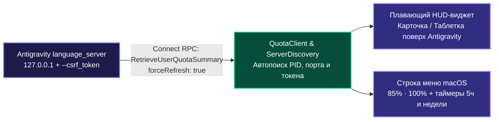
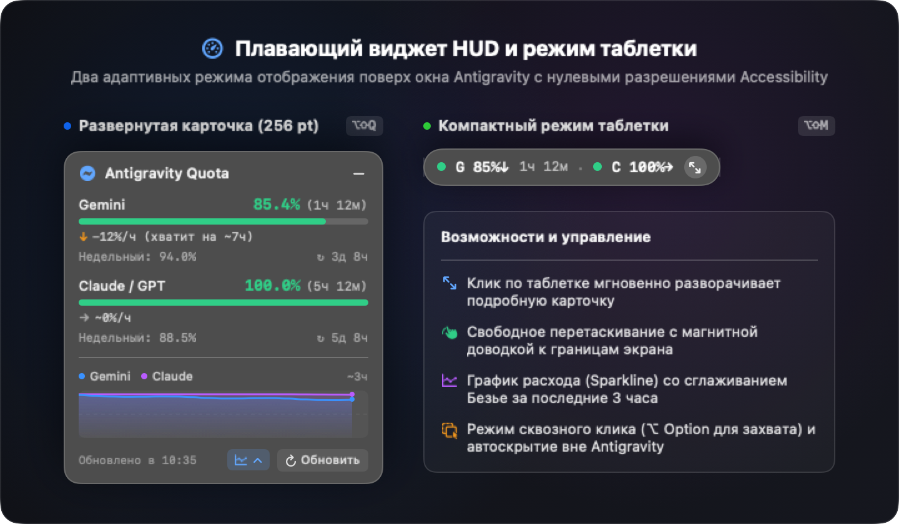
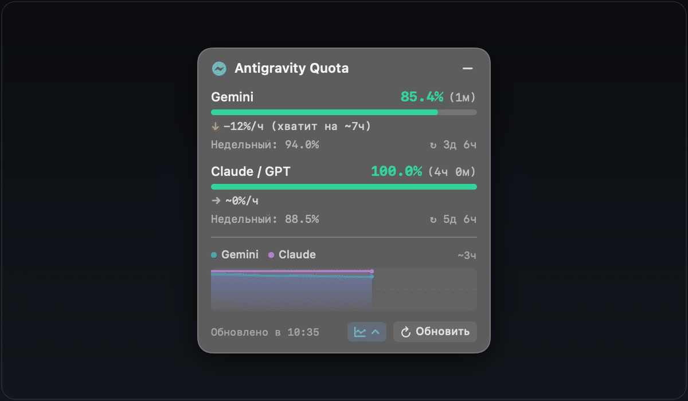
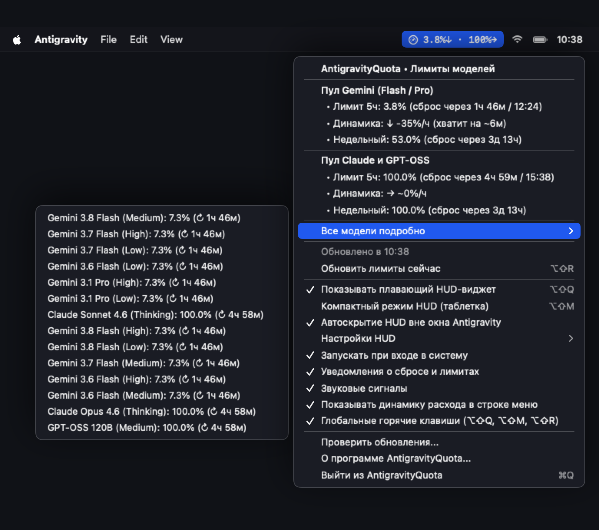
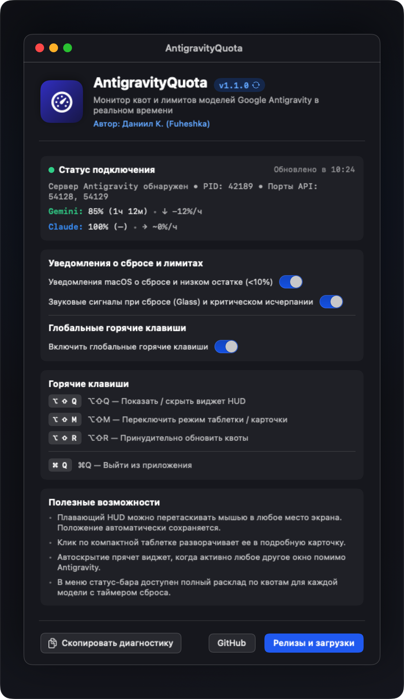

<div align="center">

# ⚡ AntigravityQuota

**Монитор лимитов моделей в реальном времени и плавающий HUD-виджет для Google Antigravity на macOS**

[](https://github.com/Fuheshka/AntigravityQuota)
[](https://swift.org)
[](LICENSE)
[]()

[**🇬🇧 English**](README.md) | [**🇷🇺 Русский**](README.ru.md)

</div>

---

## О проекте

**AntigravityQuota** - легкая нативная утилита для macOS без внешних зависимостей (`AppKit` + `SwiftUI`, фоновый режим `LSUIElement` без иконки в Dock), отображающая актуальные лимиты моделей **Google Antigravity** (**5-часовой скользящий лимит** и **недельную квоту**) по пулам **Gemini** и **Claude / GPT-OSS**.

Вместо ручного перехода в `Settings -> Models` и нажатия кнопки обновления, утилита автоматически находит локальный процесс `language_server` и каждые **20 секунд** вызывает Connect-RPC методы `RetrieveUserQuotaSummary` (`forceRefresh: true`) и `GetCascadeModelConfigData`.

---

## Основные возможности

- **Плавающий HUD-виджет поверх Antigravity (`QuotaHUDWindow`)**:
  - Полупрозрачная карточка из матового стекла (`NSVisualEffectView` `.hudWindow`) с цветными индикаторами остатка, точными процентами, обратным отсчетом до сброса и недельным лимитом.
  - **Компактный режим (таблетка)**: сворачивается в мини-пилюлю (`● G 85.4% 1ч 12м · ● C 100%`) и разворачивается обратно по обычному клику в любую область таблетки или кнопку `↖↘`.
  - **Умная видимость без прав Accessibility**: автоматически появляется поверх активного окна `Antigravity.app` и прячется при переключении в другие программы через `NSWorkspace` (не требует выдачи спецправ в настройках безопасности macOS).
  - Свободное перетаскивание мышью в любую точку экрана с сохранением позиции.
- **Индикатор в строке меню macOS (`StatusBarController`)**:
  - Постоянная сводка (`85% · 100%`) в верхнем статус-баре macOS рядом с часами.
  - Выпадающее меню с точным временем сброса 5-часовых и недельных квот, подменю со списком всех моделей, настройками HUD и автозапуском при входе в систему (`LaunchAgent`).
- **Информативное окно «О программе» и диагностика (`AboutWindowController`)**:
  - Отображение текущего статуса подключения, обнаруженного PID процесса `language_server`, портов API и живых процентов квот.
  - Памятка по всем горячим клавишам и возможностям управления (перетаскивание HUD, автоскрытие, режим таблетки).
  - Быстрое копирование полного диагностического отчета в буфер обмена одной кнопкой.
  - Прямые ссылки на GitHub-репозиторий и раздел релизов.
- **Автоматическое переподключение**: прозрачно обновляет PID, CSRF-токен и порт при перезапуске `Antigravity.app`.
- **Двуязычный интерфейс (RU / EN)**: автоматическое определение системного языка macOS.

---

## Архитектура



---
---

## Визуальный обзор интерфейса

<div align="center">

### Плавающий виджет HUD и компактный режим таблетки



<p align="center">
  <em>Два адаптивных режима: полупрозрачная карточка 256 pt с цветными индикаторами, трендами расхода и 3-часовым графиком активности (Sparklines), сворачиваемая в компактную плавающую таблетку.</em>
</p>



<p align="center">
  <em>Плавная анимация переключения между развернутой карточкой и компактной таблеткой без задержек.</em>
</p>

<br/>

### Индикатор в строке меню и выпадающее меню



<p align="center">
  <em>Актуальный статус в строке меню (<code>3.8%↓ · 100%→</code>), обратный отсчет 5-часовых и недельных окон, раскладка по отдельным моделям и быстрые настройки HUD.</em>
</p>

<br/>

### Окно «О программе и диагностика»



<p align="center">
  <em>Статус подключения к серверу (PID процесса, локальные порты API), настройка системных уведомлений, памятка горячих клавиш и копирование полного отчета в буфер обмена.</em>
</p>

</div>

---

## Глобальные горячие клавиши и управление

AntigravityQuota регистрирует системные глобальные хоткеи через нативный **Carbon Event HotKey API**. Они срабатывают глобально во всех рабочих пространствах и полноэкранных приложениях **без необходимости выдавать права Accessibility (TCC) или мониторинга ввода**.

| Сочетание | Действие | Область | Описание |
| :--- | :--- | :--- | :--- |
| **`⌥⇧Q`** (`Option + Shift + Q`) | Показать / скрыть HUD | Глобально | Мгновенно показывает или скрывает плавающий виджет на экране. |
| **`⌥⇧M`** (`Option + Shift + M`) | Переключить режим таблетки | Глобально | Переключает виджет между компактной таблеткой и карточкой 256 pt. |
| **`⌥⇧R`** (`Option + Shift + R`) | Обновить квоты сейчас | Глобально | Принудительно запрашивает свежие данные у локального Connect RPC сервера. |
| **`⌘Q`** (`Command + Q`) | Выйти из приложения | Меню / App | Корректно останавливает фоновый демон и убирает иконки из статус-бара. |

### Управление мышью и геометрия окон
- **Разворачивание в один клик:** клик по любой точке компактной таблетки (или по иконке `↖↘`) разворачивает ее в полную карточку. Кнопка с минусом (`−`) в шапке карточки сворачивает ее обратно в таблетку.
- **Магнитная доводка к границам экрана:** перетаскивайте виджет мышью в любое удобное место. При приближении к границам дисплея на 16 pt срабатывает мягкое прилипание, а координаты автоматически сохраняются в `UserDefaults`.
- **Умное якорение:** виджет размещается на уровне плавающих окон (`.floating`) на всех рабочих столах (`.canJoinAllSpaces`, `.fullScreenAuxiliary`). Правый нижний угол сохраняет привязку, поэтому переключение между таблеткой и карточкой не смещает окно за край экрана.
- **Режим сквозного клика (Click-Through):** при включении в настройках клики проходят сквозь виджет прямо в редактор кода. Зажмите клавишу **`⌥ Option`**, чтобы временно захватить виджет мышью или перетащить его без изменения настроек.
- **Автоскрытие вне Antigravity:** автоматически скрывает виджет при переключении на любое другое приложение и мгновенно возвращает его при активации `Antigravity.app`.

---

## Интерфейс командной строки (CLI)

AntigravityQuota поддерживает автономный CLI-режим (`antigravity-quota`) для терминальных мультиплексоров (**tmux**, **zellij**), кастомных статус-баров (**SketchyBar**, **SwiftBar**, **Waybar**) и лаунчеров (**Raycast**, **Alfred**).

В режиме CLI программа не поднимает графические окна и статус-бар, а выполняет одиночный Connect-RPC запрос к локальному `language_server`, выводит результат в `stdout` и мгновенно завершается с кодом 0 (или кодом 1 при ошибке подключения).

### Флаги командной строки

| Флаг | Назначение | Пример вывода / формат |
| :--- | :--- | :--- |
| `--status`, `-s` | Компактная строка статуса | `G 85.4% (1ч 12м) · C 100.0%` |
| `--json`, `-j` | Полный JSON-снимок состояния | Структурированный JSON с пулами, моделями и таймерами |
| `--history` | Таблица недавних замеров из истории | Unicode ASCII-таблица Box-Drawing |
| `--export-history` | Экспорт всей истории за 7 дней | JSON-массив замеров с временными метками |
| `-h`, `--help` | Справка по использованию | Текст справки и примеры конфигурации |

#### Пример: компактный статус
```bash
antigravity-quota --status
# Вывод: G 85.4% (1ч 12м) · C 100.0%
```

#### Пример: полный JSON-снимок
```bash
antigravity-quota --json
```
```json
{
  "updatedAt": "2026-10-01T10:24:00Z",
  "summary": {
    "gemini": { "percentage": 85.4, "resetCountdown": "1ч 12м", "resetTime": "2026-10-01T11:36:00Z" },
    "claude": { "percentage": 100.0, "resetCountdown": "—", "resetTime": "2026-10-01T15:24:00Z" },
    "status": "G 85.4% (1ч 12м) · C 100.0%"
  },
  "groups": [
    {
      "displayName": "Gemini Models",
      "shortName": "Gemini",
      "buckets": [
        { "window": "5h", "percentage": 85.4, "remainingFraction": 0.854, "resetCountdown": "1ч 12м" },
        { "window": "weekly", "percentage": 94.0, "remainingFraction": 0.940, "resetCountdown": "3д 8ч" }
      ]
    }
  ]
}
```

#### Пример: таблица истории замеров
```bash
antigravity-quota --history
```
```text
┌──────────────────────┬─────────────┬─────────────┐
│ Дата и время         │ Пул Gemini  │ Пул Claude  │
├──────────────────────┼─────────────┼─────────────┤
│ 2026-10-01 10:24:00  │ 85.4%       │ 100.0%      │
│ 2026-10-01 10:20:00  │ 86.8%       │ 100.0%      │
│ 2026-10-01 10:00:00  │ 92.1%       │ 100.0%      │
└──────────────────────┴─────────────┴─────────────┘
```

### Установка симлинка CLI

При установке через Homebrew Cask исполняемый файл `antigravity-quota` автоматически добавляется в системный PATH.

При ручной установке создайте симлинк:

```bash
# Автоматический скрипт (создает симлинк в ~/.local/bin или /usr/local/bin)
./scripts/install_cli_symlink.sh

# Либо вручную в /usr/local/bin (требуются права администратора):
sudo ln -sf "/Applications/AntigravityQuota.app/Contents/MacOS/AntigravityQuota" /usr/local/bin/antigravity-quota
```

### Примеры интеграций

Готовые легковесные плагины с Nerd Font иконками, цветовой индикацией, раскладкой моделей и быстрыми действиями доступны в папке [`integrations/`](integrations/README.md):

- **[Команда для Raycast](integrations/raycast/antigravity-quota.sh)**:
  Отображает живой остаток квот в поисковой строке Raycast с возможностью открыть подробную сводку по ключу `--full`.
- **[Плагин для SketchyBar](integrations/sketchybar/README.md)**:
  Скрипт `integrations/sketchybar/antigravity_quota.sh` форматирует квоты с Nerd Font иконками (`󰛩`, `󰚩`), таймерами сброса и ARGB цветами (>50% зеленый, 20-50% оранжевый, <20% красный).
  ```bash
  sketchybar --add item antigravity_quota right \
             --set antigravity_quota update_freq=30 icon.drawing=off \
                                     script="~/.config/sketchybar/plugins/antigravity_quota.sh"
  ```
- **[Плагин для SwiftBar и BitBar](integrations/swiftbar/antigravity_quota.1m.sh)**:
  Выводит компактный статус в строку меню и разворачивает интерактивное выпадающее меню со списком моделей, счетчиками 5-часовых/недельных окон и быстрыми действиями («Открыть Antigravity», «Обновить квоты»).
- **Строка состояния tmux**:
  ```tmux
  set -g status-right '#(antigravity-quota --status) | %H:%M'
  ```

---

## Установка и запуск

### Homebrew (рекомендуется)

Установка и обновление AntigravityQuota одной терминальной командой через официальный Homebrew Cask:

```bash
# Подключение репозитория
brew tap Fuheshka/antigravityquota https://github.com/Fuheshka/AntigravityQuota

# Установка приложения и утилиты antigravity-quota в PATH
brew install --cask antigravity-quota
```

Обновление до свежей версии:
```bash
brew upgrade --cask antigravity-quota
```

### Загрузка готового релиза

Скачайте готовый `.dmg` или `.zip` установщик со страницы [GitHub Releases](https://github.com/Fuheshka/AntigravityQuota/releases/latest).

### Сборка из исходников

#### Системные требования
- macOS 13.0 (Ventura) или новее
- Swift 5.9+ (Xcode Command Line Tools)

```bash
git clone https://github.com/Fuheshka/AntigravityQuota.git
cd AntigravityQuota

# Запуск модульных тестов
swift test

# Сборка Release-версии и установка в /Applications/AntigravityQuota.app
./scripts/build_app.sh

# Запуск приложения
open /Applications/AntigravityQuota.app
```

---

## Как помочь проекту

Мы рады любому участию в развитии AntigravityQuota! Вот как можно внести свой вклад:

- 🐛 **Сообщить о баге**: Нашли ошибку или сбой отображения? Создайте [Issue с описанием бага](https://github.com/Fuheshka/AntigravityQuota/issues/new?template=bug_report.md).
- 💡 **Предложить идею**: Нужна новая интеграция, виджет или хоткей? Откройте [Feature request](https://github.com/Fuheshka/AntigravityQuota/issues/new?template=feature_request.md).
- 🛠 **Отправить Pull Request**: Хотите исправить баг или добавить улучшение? Ознакомьтесь с [руководством по участию (CONTRIBUTING.md)](CONTRIBUTING.md) и открывайте PR!
- ⭐️ **Поставить звезду**: Поддержите репозиторий звездочкой на GitHub, чтобы помочь проекту развиваться.

---

## Автор и поддержка

Сделано с душой и любовью ❤️

**Даниил К. (Fuheshka)**

- 💬 **Telegram:** [@fuheshka](https://t.me/fuheshka)
- ✉️ **Email:** [me@kuviko.ru](mailto:me@kuviko.ru)
- ☕ **Поддержать чашкой кофе (СБП / T-Pay):** [pay.cloudtips.ru/p/7adeaa28](https://pay.cloudtips.ru/p/7adeaa28)
- 💎 **TON:** `UQC-DsraaDQRjUjG9oPRkt5nGlMgxKY-pjMC6xeeYGfxiu9a`

---

## Лицензия

Проект распространяется под лицензией [MIT](LICENSE).
