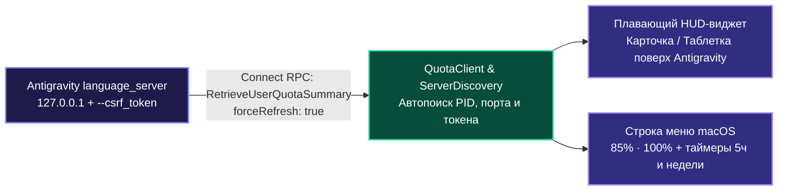

<div align="center">

# ⚡ AntigravityQuota

**Монитор лимитов моделей в реальном времени и плавающий HUD-виджет для Google Antigravity на macOS**

[](https://github.com/Fuheshka/AntigravityQuota)
[](https://swift.org)
[](LICENSE)
[]()

[**🇬🇧 English**](README.md) | [**🇷🇺 Русский**](README.ru.md)

</div>

---

## О проекте

**AntigravityQuota** - легкая нативная утилита для macOS без внешних зависимостей (`AppKit` + `SwiftUI`, фоновый режим `LSUIElement` без иконки в Dock), отображающая актуальные лимиты моделей **Google Antigravity** (**5-часовой скользящий лимит** и **недельную квоту**) по пулам **Gemini** и **Claude / GPT-OSS**.

Вместо ручного перехода в `Settings -> Models` и нажатия кнопки обновления, утилита автоматически находит локальный процесс `language_server` и каждые **20 секунд** вызывает Connect-RPC методы `RetrieveUserQuotaSummary` (`forceRefresh: true`) и `GetCascadeModelConfigData`.

---

## Основные возможности

- **Плавающий HUD-виджет поверх Antigravity (`QuotaHUDWindow`)**:
  - Полупрозрачная карточка из матового стекла (`NSVisualEffectView` `.hudWindow`) с цветными индикаторами остатка, точными процентами, обратным отсчетом до сброса и недельным лимитом.
  - **Компактный режим (таблетка)**: сворачивается в мини-пилюлю (`● G 85.4% 1ч 12м · ● C 100%`) и разворачивается обратно по обычному клику в любую область таблетки или кнопку `↖↘`.
  - **Умная видимость без прав Accessibility**: автоматически появляется поверх активного окна `Antigravity.app` и прячется при переключении в другие программы через `NSWorkspace` (не требует выдачи спецправ в настройках безопасности macOS).
  - Свободное перетаскивание мышью в любую точку экрана с сохранением позиции.
- **Индикатор в строке меню macOS (`StatusBarController`)**:
  - Постоянная сводка (`85% · 100%`) в верхнем статус-баре macOS рядом с часами.
  - Выпадающее меню с точным временем сброса 5-часовых и недельных квот, подменю со списком всех моделей, настройками HUD и автозапуском при входе в систему (`LaunchAgent`).
- **Информативное окно «О программе» и диагностика (`AboutWindowController`)**:
  - Отображение текущего статуса подключения, обнаруженного PID процесса `language_server`, портов API и живых процентов квот.
  - Памятка по всем горячим клавишам и возможностям управления (перетаскивание HUD, автоскрытие, режим таблетки).
  - Быстрое копирование полного диагностического отчета в буфер обмена одной кнопкой.
  - Прямые ссылки на GitHub-репозиторий и раздел релизов.
- **Автоматическое переподключение**: прозрачно обновляет PID, CSRF-токен и порт при перезапуске `Antigravity.app`.
- **Двуязычный интерфейс (RU / EN)**: автоматическое определение системного языка macOS.

---

## Архитектура



---

## Горячие клавиши (в меню статус-бара)

| Сочетание | Действие |
| :--- | :--- |
| `⌘R` | Принудительно обновить лимиты сейчас |
| `⌘H` | Показать / скрыть плавающий HUD-виджет |
| `⌘M` | Переключить компактный режим HUD (таблетка) |
| `⌘Q` | Выйти из AntigravityQuota |

---

## Сборка и установка

### Системные требования
- macOS 13.0 (Ventura) или новее
- Swift 5.9+ (Xcode Command Line Tools)

### Сборка из исходников

```bash
git clone https://github.com/Fuheshka/AntigravityQuota.git
cd AntigravityQuota

# Запуск модульных тестов
swift test

# Сборка Release-версии и установка в /Applications/AntigravityQuota.app
./scripts/build_app.sh

# Запуск приложения
open /Applications/AntigravityQuota.app
```

---

## Автор

Разработчик: **Даниил К. ([@Fuheshka](https://github.com/Fuheshka))**.

---

## Лицензия

Проект распространяется под лицензией [MIT](LICENSE).
